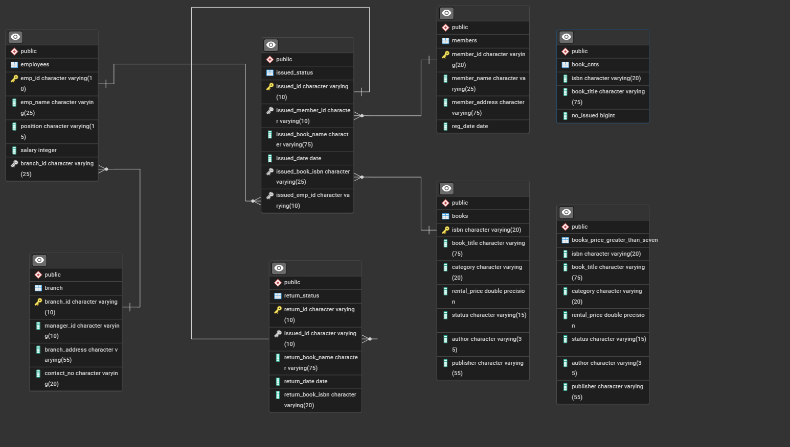

# Library Management System using SQL Project --P2

## Project Overview

**Project Title**: Library Management System  
**Level**: Intermediate  
**Database**: `library_project_2`

This project demonstrates the implementation of a Library Management System using SQL. It includes creating and managing tables, performing CRUD operations, and executing advanced SQL queries. The goal is to showcase skills in database design, manipulation, and querying.


## Objectives

1. **Set up the Library Management System Database**: Create and populate the database with tables for branches, employees, members, books, issued status, and return status.
2. **CRUD Operations**: Perform Create, Read, Update, and Delete operations on the data.
3. **CTAS (Create Table As Select)**: Utilize CTAS to create new tables based on query results.
4. **Perform Tasks**: Perform different tasks.

## Project Structure

### 1. Database Setup


- **Database Creation**: Created a database named `library_project_2`.
- **Table Creation**: Created tables for branches, employees, members, books, issued status, and return status. Each table includes relevant columns and relationships.

```sql

--CREATING BRANCH TABLE
DROP TABLE IF EXISTS branch;
CREATE TABLE branch(
branch_id	VARCHAR(10) PRIMARY KEY,
manager_id	VARCHAR(10),
branch_address	VARCHAR(55),
contact_no VARCHAR(10)
);

--CREATING EMPLOYEES TABLE
DROP TABLE IF EXISTS employees;
CREATE TABLE employees(
emp_id VARCHAR(10) PRIMARY KEY,
emp_name VARCHAR(25),
position VARCHAR(15),
salary INT,
branch_id VARCHAR(25) --FK
);

--CREATING BOOKS TABLE
DROP TABLE IF EXISTS books;
CREATE TABLE books(
isbn VARCHAR(20) PRIMARY KEY,
book_title VARCHAR(75),
category VARCHAR(10),
rental_price FLOAT,
status	VARCHAR(15),
author	VARCHAR(35),
publisher VARCHAR(55)
);

--CREATING MEMBER TABLE
DROP TABLE IF EXISTS members;
CREATE TABLE members(
member_id VARCHAR(20) PRIMARY KEY,
member_name	VARCHAR(25),
member_address VARCHAR(75),
reg_date DATE
);

--CREATING ISSUE STATUS TABLE
DROP TABLE IF EXISTS issued_status;
CREATE TABLE issued_status(
issued_id VARCHAR(10) PRIMARY KEY,
issued_member_id VARCHAR(10), --FK
issued_book_name VARCHAR(75),
issued_date	 DATE,
issued_book_isbn VARCHAR(25), --FK
issued_emp_id VARCHAR(10) --FK
);

--CREATING RETURN STATUS TABLE
DROP TABLE IF EXISTS return_status;
CREATE TABLE return_status(
return_id VARCHAR(10) PRIMARY KEY,
issued_id VARCHAR(10),
return_book_name VARCHAR(75),
return_date DATE,
return_book_isbn VARCHAR(20)
);

```

### Foriegn Key
```sql
ALTER TABLE issued_status
ADD CONSTRAINT fk_members
FOREIGN KEY(issued_member_id)
REFERENCES members(member_id);

ALTER TABLE issued_status
ADD CONSTRAINT fk_books
FOREIGN KEY(issued_book_isbn)
REFERENCES books(isbn);

ALTER TABLE issued_status
ADD CONSTRAINT fk_employees
FOREIGN KEY(issued_emp_id)
REFERENCES employees(emp_id);

ALTER TABLE employees
ADD CONSTRAINT fk_branch
FOREIGN KEY(branch_id)
REFERENCES branch(branch_id);

ALTER TABLE return_status
ADD CONSTRAINT fk_issued_status
FOREIGN KEY(issued_id)
REFERENCES issued_status(issued_id);
```

### 2. CRUD Operations

- **Create**: Inserted sample records into the `books` table.
- **Read**: Retrieved and displayed data from various tables.
- **Update**: Updated records in the `employees` table.
- **Delete**: Removed records from the `members` table as needed.

**Task 1. Create a New Book Record**
-- "978-1-60129-456-2', 'To Kill a Mockingbird', 'Classic', 6.00, 'yes', 'Harper Lee', 'J.B. Lippincott & Co.')"

```sql
INSERT INTO books(isbn, book_title, category, rental_price, status, author, publisher)
VALUES('978-1-60129-456-2', 'To Kill a Mockingbird', 'Classic', 6.00, 'yes', 'Harper Lee', 'J.B. Lippincott & Co.');
SELECT * FROM books;
```
**Task 2: Update an Existing Member's Address**

```sql
UPDATE members
SET member_address = '125 Oak St'
WHERE member_id = 'C103';
```

**Task 3: Delete a Record from the Issued Status Table**
-- Objective: Delete the record with issued_id = 'IS121' from the issued_status table.

```sql
DELETE FROM issued_status
WHERE   issued_id =   'IS121';
```

**Task 4: Retrieve All Books Issued by a Specific Employee**
-- Objective: Select all books issued by the employee with emp_id = 'E101'.
```sql
SELECT * FROM issued_status
WHERE issued_emp_id = 'E101'
```


**Task 5: List Members Who Have Issued More Than One Book**
-- Objective: Use GROUP BY to find members who have issued more than one book.

```sql
SELECT
    issued_emp_id,
    COUNT(*)
FROM issued_status
GROUP BY 1
HAVING COUNT(*) > 1
```

### 3. CTAS (Create Table As Select)

- **Task 6: Create Summary Tables**: Used CTAS to generate new tables based on query results - each book and total book_issued_cnt**

```sql
CREATE TABLE book_issued_cnt AS
SELECT b.isbn, b.book_title, COUNT(ist.issued_id) AS issue_count
FROM issued_status as ist
JOIN books as b
ON ist.issued_book_isbn = b.isbn
GROUP BY b.isbn, b.book_title;
```


### 4. Data Analysis & Findings

The following SQL queries were used to address specific questions:

Task 7. **Retrieve All Books in a Specific Category**:

```sql
SELECT * FROM books
WHERE category = 'Classic';
```

8. **Task 8: Find Total Rental Income by Category**:

```sql
SELECT 
    b.category,
    SUM(b.rental_price),
    COUNT(*)
FROM 
issued_status as ist
JOIN
books as b
ON b.isbn = ist.issued_book_isbn
GROUP BY 1
```

9. **List Members Who Registered in the Last 180 Days**:
```sql
SELECT * FROM members
WHERE reg_date >= CURRENT_DATE - INTERVAL '180 days';
```

10. **List Employees with Their Branch Manager's Name and their branch details**:

```sql
SELECT 
    e1.emp_id,
    e1.emp_name,
    e1.position,
    e1.salary,
    b.*,
    e2.emp_name as manager
FROM employees as e1
JOIN 
branch as b
ON e1.branch_id = b.branch_id    
JOIN
employees as e2
ON e2.emp_id = b.manager_id
```

Task 11. **Create a Table of Books with Rental Price Above a Certain Threshold**:
```sql
CREATE TABLE expensive_books AS
SELECT * FROM books
WHERE rental_price > 7.00;
```

Task 12: **Retrieve the List of Books Not Yet Returned**
```sql
SELECT * FROM issued_status as ist
LEFT JOIN
return_status as rs
ON rs.issued_id = ist.issued_id
WHERE rs.return_id IS NULL;
```

## Reports

- **Database Schema**: Detailed table structures and relationships.
- **Data Analysis**: Insights into book categories, employee salaries, member registration trends, and issued books.
- **Summary Reports**: Aggregated data on high-demand books and employee performance.

## Conclusion

This project demonstrates the application of SQL skills in creating and managing a library management system. It includes database setup, data manipulation, and advanced querying, providing a solid foundation for data management and analysis.

- **LinkedIn**: [Connect with me professionally](www.linkedin.com/in/smtahaimran)

Thank you for your interest in this project!
